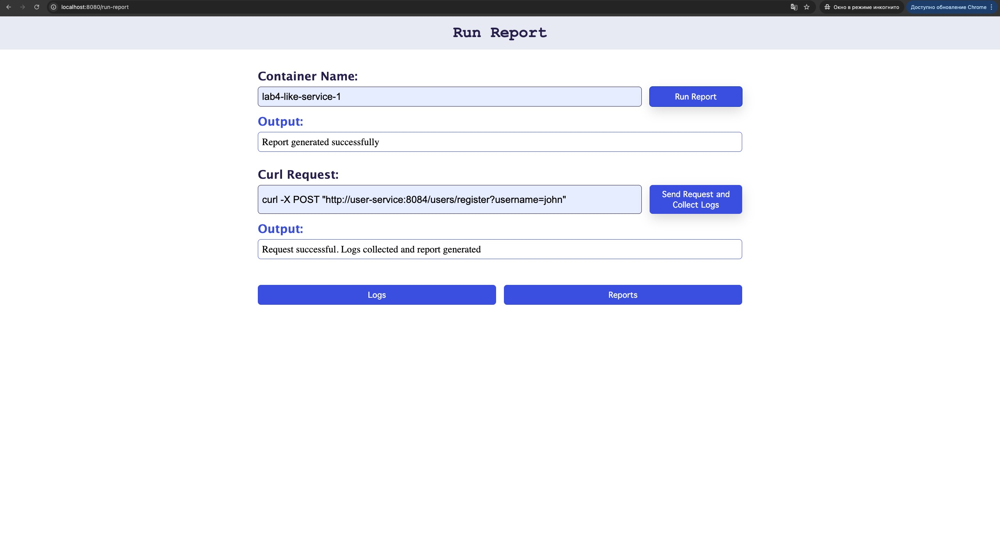
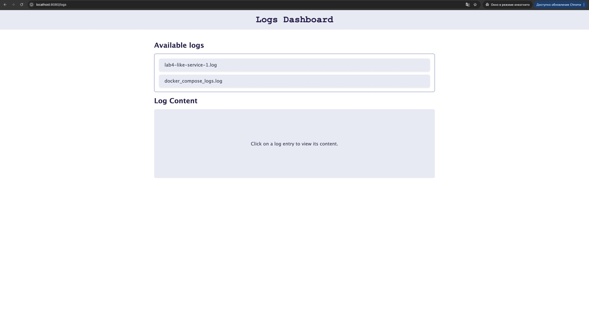
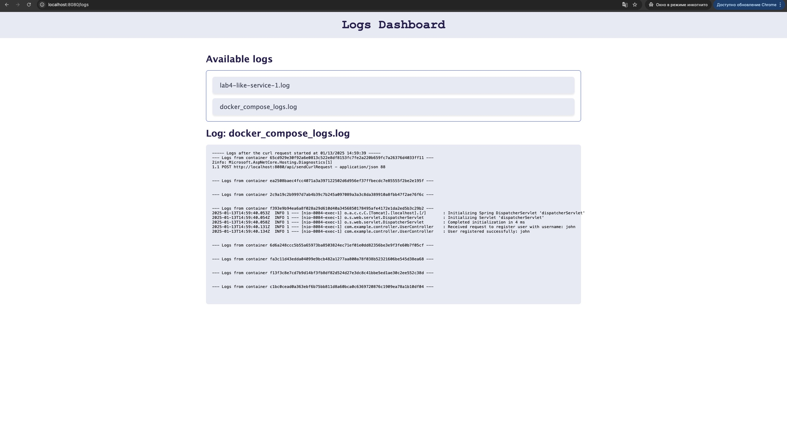
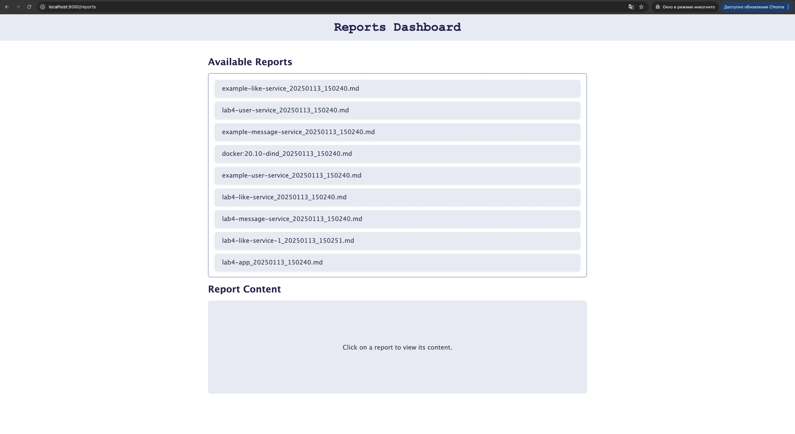
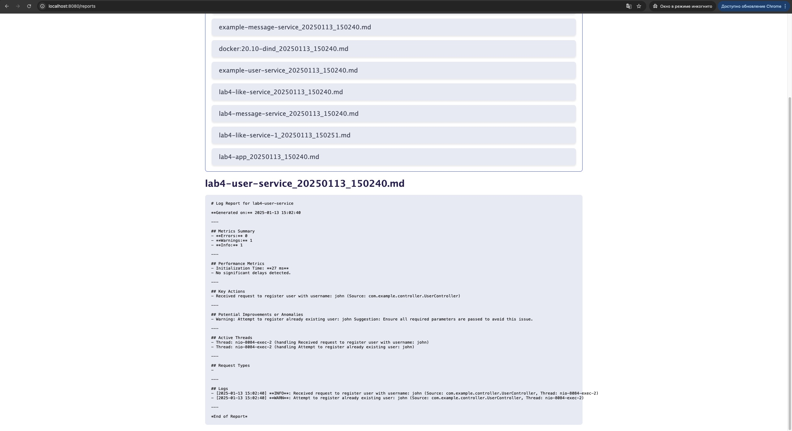
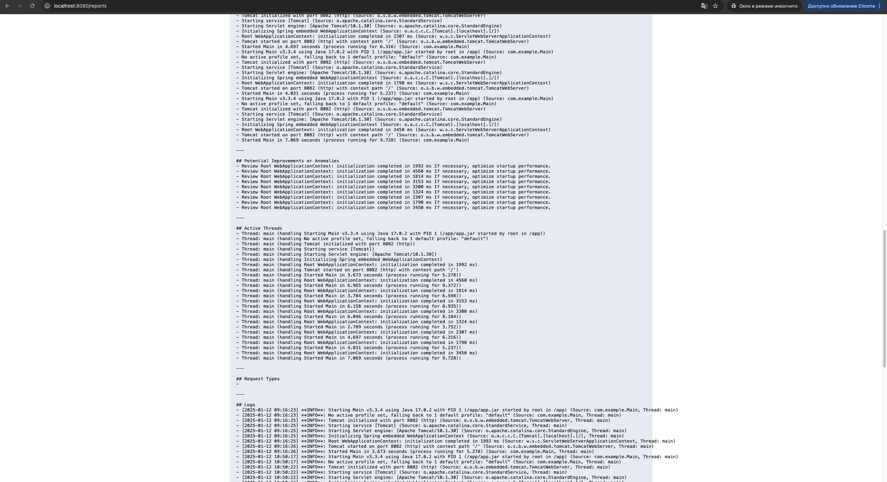

# Lab № 4

## Log collector for microservices and parsing to reports *.md

`Шевченко Дарья Павловна, Толстых Мария Алексеевна`

В веб приложении можно по имени контейнера собрать логи и сгенерировать отчет с основными характеристиками потока информации:

- дата и время сбора информации
- количество ошибок, предупреждений, информационных сообщений
- метрики производительности (время инициализации)
- ключевые действия
- потенциальные улучшения или аномалии
- активные потоки
- логи
  
Можно отправить curl запрос, после которого будут собраны логи со всех микросервисов, тем самым можно проследить путь запроса и информацию о нем в отчете

Примеры запросов:

```bash
curl -X POST "http://user-service:8084/users/register?username=john"

curl -X POST "http://message-service:8081/messages/post?username=john&content=Hello%2C%20World"

curl -X POST "http://user-service:8084/users/register?username=john" && curl -X POST "http://message-service:8081/messages/post?username=john&content=Hello%2C%20World"

curl -X GET "http://like-service:8082/likes/0"
```

### Enter name and request



### Logs page



### Logs example



### Report page



### Reports example





Инструкция по запуску:

```bash
cd lab4/lab4/front
npm install
dotnet fable watch --verbose --run npx vite

docker compose build
docker compose up -d
```
